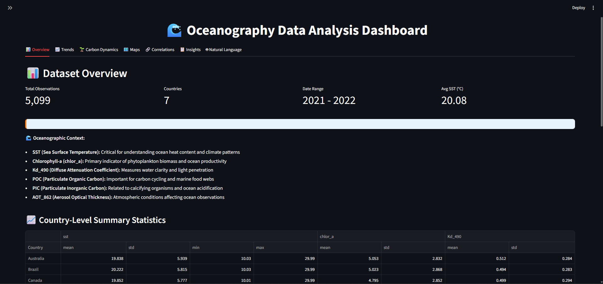
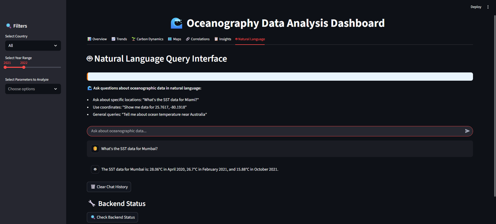
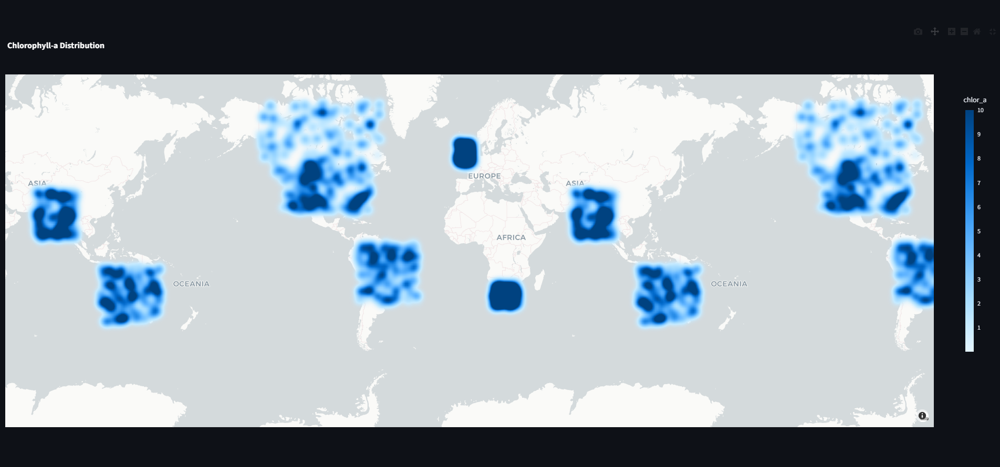

# 🌊 Visual FloatChat: An AI-Powered Gateway to Ocean Data

[](https://sih.gov.in/)
[](https://www.python.org/)
[](https://streamlit.io/)
[](https://www.langchain.com/)

<p align="center">
  <strong>Chat with the Ocean. Unlock its Secrets.</strong>
</p>

<p align="center">
  Visual FloatChat is an AI-powered conversational system that makes complex ARGO float data accessible to everyone, from researchers to enthusiasts, through natural language and interactive visualizations.
</p>

---

---

## 🎯 The Problem

Oceanographic data is vast, complex, and often locked away in specialized formats like NetCDF. Analyzing this data from sources like the ARGO program requires significant domain knowledge and technical skill, creating a barrier for non-expert users who need to make data-driven decisions.

## ✨ Our Solution

**Visual FloatChat** bridges this gap with a two-part system:

1.  **An Interactive Dashboard:** A powerful tool for visually exploring oceanographic data with maps, charts, and trend analysis.
2.  **An AI Chat Assistant:** A conversational interface that allows users to query the data in plain English, abstracting away the complexity of database queries and data formats.

Our solution ingests raw ARGO NetCDF files, processes them through an automated ETL pipeline, and serves the insights through a user-friendly web interface.

## 🚀 Key Features

*   **Automated Data Pipeline:** A robust Bronze → Silver → Gold pipeline that processes raw `.nc` files into a clean, query-ready Parquet and PostgreSQL format.
*   **Conversational Chat Interface:** Ask questions in natural language, like *"What is the sea surface temperature near Miami?"* or *"Show me data for coordinates -24.1, 151.8"*.
*   **RAG-Powered AI:** Utilizes a Retrieval-Augmented Generation (RAG) pipeline with LangChain and a Chroma vector database to provide accurate, context-aware answers.
*   **Interactive Dashboard:** A comprehensive Streamlit dashboard for deep data exploration, featuring:
    *   Geospatial maps (Heatmaps & Scatterplots)
    *   Time-series trend analysis
    *   Correlation matrices
    *   Country-specific data filtering
*   **Data Enrichment:** Automatically enriches data points with geographical context (Country, City) using reverse geocoding.

## 🏗️ System Architecture(Medallion Architecture)

Our system follows a modern data architecture to ensure scalability and maintainability.

<!-- You can create a simple diagram using a tool like diagrams.net and add it here -->
 <!-- Replace with your architecture diagram image -->

1.  **Bronze Layer:** Raw ARGO NetCDF files are ingested.
2.  **Silver Layer:** Data is cleaned, standardized, and converted to Parquet format for each variable.
3.  **Gold Layer:** All variables are merged into a single, analytics-ready Parquet file.
4.  **Platinum Layer:** The gold data is loaded into two destinations:
    *   **PostgreSQL:** For fast, structured queries to power the main dashboard.
    *   **ChromaDB:** A vector database stores embeddings of the data for semantic search and the RAG pipeline.
5.  **Backend (Flask):** A Flask server hosts the LangChain agent, which interprets user queries and retrieves data from ChromaDB.
6.  **Frontend (Streamlit):** A single, integrated Streamlit application provides both the interactive dashboard and the chatbot interface, which communicates with the Flask backend.

## 🛠️ Tech Stack

*   **Frontend:** Streamlit, Plotly, Folium
*   **Backend:** Flask, LangChain
*   **AI/ML:** Google Gemini, ChromaDB (Vector Store), Pandas, XArray
*   **Databases:** PostgreSQL, Parquet
*   **Languages:** Python

## 📸 Screenshots

#### Main Dashboard
 
> *The main dashboard provides a comprehensive overview with metrics, country-level statistics, and parameter distributions.*

#### Conversational AI Chat
 
> *Users can query data by city name or exact coordinates and receive detailed, human-readable results.*

#### Geospatial Analysis
 
> *Visualize Sea Surface Temperature, Chlorophyll-a, and other parameters on an interactive world map.*

## ⚙️ Getting Started

Follow these steps to run the project locally.

### 1. Prerequisites
*   Python 3.9+
*   PostgreSQL database running locally.

### 2. Clone the Repository
```bash
git clone https://github.com/Samarth-3910/FloatChat-AI
cd visual-float-chat
```

### 3. Set Up Environment
Create a `.env` file in the root directory and add your Google API Key:
```env
GOOGLE_API_KEY="AIzaSy...Your...Key"
```

### 4. Run the Data Pipeline
*   Place your ARGO `.nc` files in the `Bronze_Data/` directory, following the structure `Bronze_Data/<year>/<month>/<variable>/`.
*   Run the main ETL pipeline notebook (`main.ipynb`) to process the data and create the Gold Layer parquet file.
*   Run the `posgres_table.py` script to load the generated CSV/Parquet from the Gold Layer into your PostgreSQL database.

### 5. Launch the Application
We've included an auto-runner to make launching easy! It will install dependencies and start both the backend and frontend servers.

```bash
python run.py
```
You can now access the application at **http://localhost:8501**.

## 🔮 Future Work
- [ ] Integrate real-time data streams from active ARGO floats.
- [ ] Expand data sources to include BGC floats, gliders, and satellite datasets.
- [ ] Add more advanced analytical features like anomaly detection.
- [ ] Deploy the application to a cloud service (e.g., AWS, GCP) for public access.

## 🏆 Our Team
*   [Your Name](https://github.com/your-username)
*   [Team Member 2](https://github.com/teammate-username)
*   [Team Member 3](https://github.com/teammate-username)
