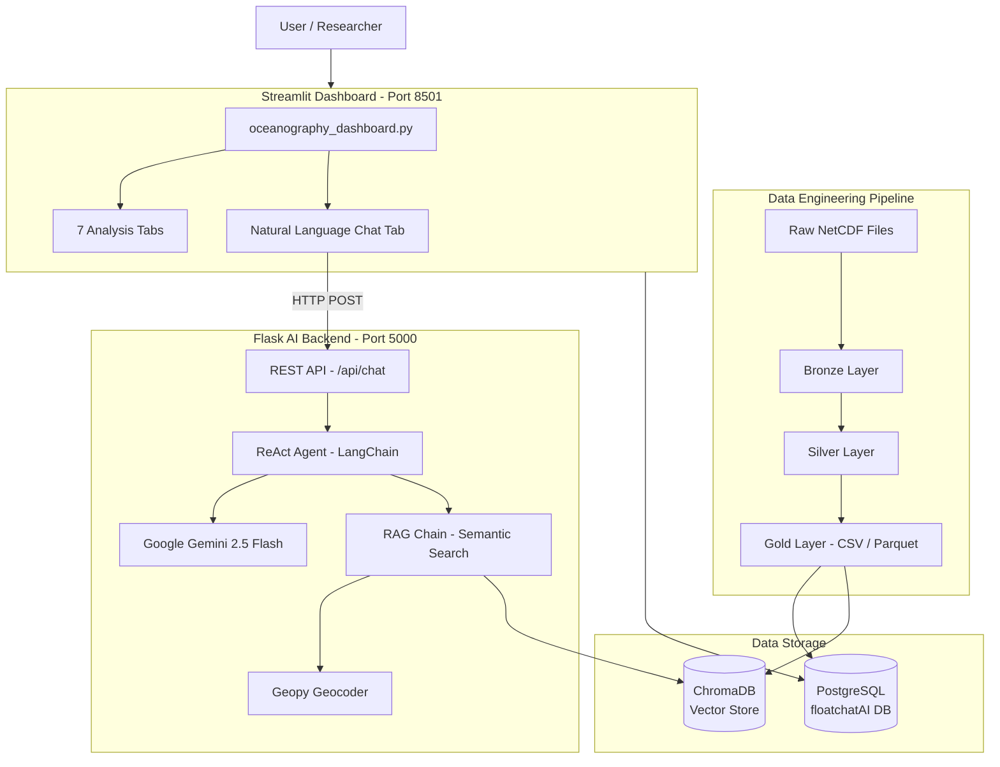
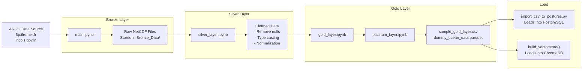
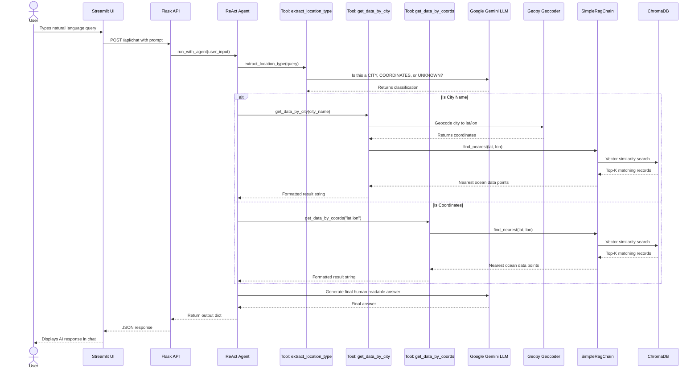
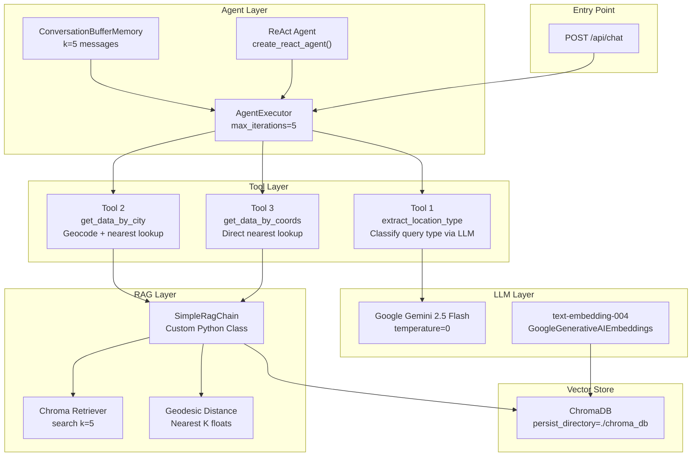
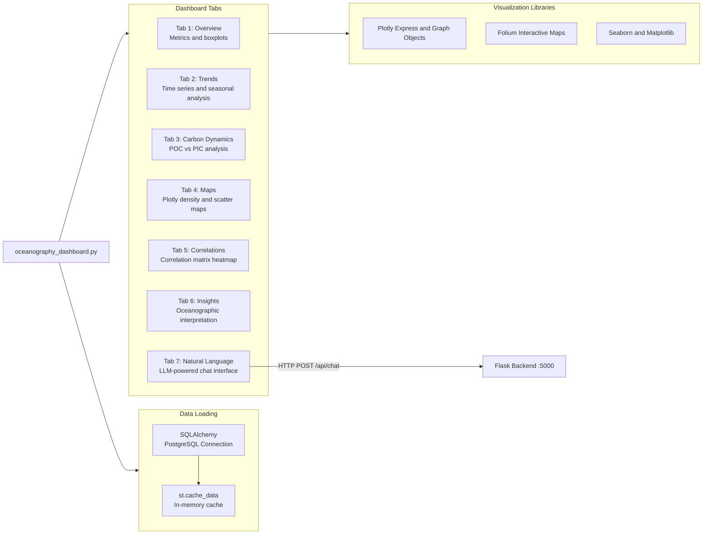
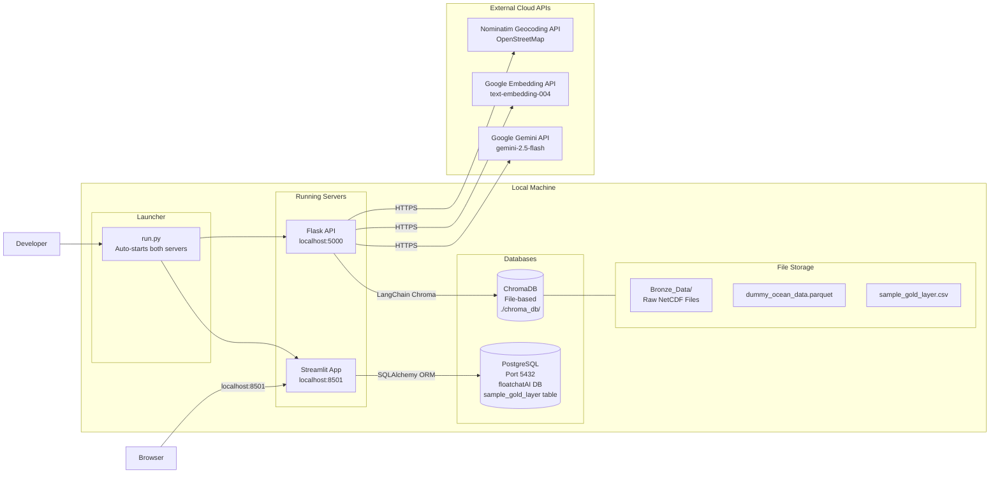

# 🌊 Visual FloatChat

**Visual FloatChat** is an AI-powered conversational system that makes oceanographic (ARGO float) data accessible through natural language and interactive visualizations.

## 🚀 Overview

This project bridges the gap between complex NetCDF ocean data and users by providing:
1.  **Interactive Dashboard:** For exploring maps, charts, and trends.
2.  **AI Chat Assistant:** For querying data in plain English (e.g., *"What is the temperature near Miami?"*).

## 📂 Repository Structure

The project is organized into the following key directories:

*   **`AnalyticalGenAI/`**: Contains the core application logic.
    *   `app.py`: Flask backend server for the AI assistant.
    *   `oceanography_dashboard.py`: Streamlit frontend application.
    *   `run.py`: Auto-runner script to launch both servers.
    *   `chroma_db/`: Vector database storage.
*   **`DataEngineering/`**: Contains the ETL pipeline for data processing.
    *   `Bronze_Data/`: Storage for raw Bronze layer files.
    *   `main.ipynb`: Main notebook running the extraction and transformation pipeline.
    *   `silver_layer.ipynb`, `gold_layer.ipynb`: Notebooks for intermediate data processing.
*   **`Others/`**: Supplementary files and resources.

# System Architecture

---

## 1. High-Level System Overview


```mermaid
flowchart TD
    User["User / Researcher"]

    subgraph ETL["Data Engineering Pipeline"]
        NetCDF["Raw NetCDF Files"]
        Bronze["Bronze Layer"]
        Silver["Silver Layer"]
        Gold["Gold Layer - CSV / Parquet"]
        NetCDF --> Bronze --> Silver --> Gold
    end

    subgraph Storage["Data Storage"]
        PG[("PostgreSQL\nfloatchatAI DB")]
        Chroma[("ChromaDB\nVector Store")]
    end

    subgraph Backend["Flask AI Backend - Port 5000"]
        API["REST API - /api/chat"]
        Agent["ReAct Agent - LangChain"]
        RAG["RAG Chain - Semantic Search"]
        GeminiLLM["Google Gemini 2.5 Flash"]
        Geopy["Geopy Geocoder"]
        API --> Agent
        Agent --> GeminiLLM
        Agent --> RAG
        RAG --> Geopy
    end

    subgraph Frontend["Streamlit Dashboard - Port 8501"]
        Dashboard["oceanography_dashboard.py"]
        Tabs["7 Analysis Tabs"]
        ChatUI["Natural Language Chat Tab"]
        Dashboard --> Tabs
        Dashboard --> ChatUI
    end

    Gold --> PG
    Gold --> Chroma
    RAG --> Chroma
    Frontend --> PG
    ChatUI -->|"HTTP POST"| API
    User --> Frontend
```

---

## 2. Data Engineering Pipeline (ETL)


```mermaid
flowchart LR
    A["ARGO Data Source\nftp.ifremer.fr\nincois.gov.in"]

    subgraph B["Bronze Layer"]
        B1["main.ipynb"]
        B2["Raw NetCDF Files\nStored in Bronze_Data/"]
    end

    subgraph S["Silver Layer"]
        S1["silver_layer.ipynb"]
        S2["Cleaned Data\n- Remove nulls\n- Type casting\n- Normalization"]
    end

    subgraph G["Gold Layer"]
        G1["gold_layer.ipynb"]
        G2["platinum_layer.ipynb"]
        G3["sample_gold_layer.csv\ndummy_ocean_data.parquet"]
    end

    subgraph L["Load"]
        L1["import_csv_to_postgres.py\nLoads into PostgreSQL"]
        L2["build_vectorstore()\nLoads into ChromaDB"]
    end

    A --> B1 --> B2 --> S1 --> S2 --> G1 --> G2 --> G3
    G3 --> L1
    G3 --> L2
```

---

## 3. AI and RAG Query Flow


```mermaid
sequenceDiagram
    actor User
    participant UI as Streamlit UI
    participant Flask as Flask API
    participant Agent as ReAct Agent
    participant T1 as Tool: extract_location_type
    participant T2 as Tool: get_data_by_city
    participant T3 as Tool: get_data_by_coords
    participant LLM as Google Gemini LLM
    participant Geo as Geopy Geocoder
    participant RAG as SimpleRagChain
    participant DB as ChromaDB

    User->>UI: Types natural language query
    UI->>Flask: POST /api/chat with prompt
    Flask->>Agent: run_with_agent(user_input)
    Agent->>T1: extract_location_type(query)
    T1->>LLM: Is this a CITY, COORDINATES, or UNKNOWN?
    LLM-->>T1: Returns classification

    alt Is City Name
        Agent->>T2: get_data_by_city(city_name)
        T2->>Geo: Geocode city to lat/lon
        Geo-->>T2: Returns coordinates
        T2->>RAG: find_nearest(lat, lon)
        RAG->>DB: Vector similarity search
        DB-->>RAG: Top-K matching records
        RAG-->>T2: Nearest ocean data points
        T2-->>Agent: Formatted result string
    else Is Coordinates
        Agent->>T3: get_data_by_coords("lat,lon")
        T3->>RAG: find_nearest(lat, lon)
        RAG->>DB: Vector similarity search
        DB-->>RAG: Top-K matching records
        RAG-->>T3: Nearest ocean data points
        T3-->>Agent: Formatted result string
    end

    Agent->>LLM: Generate final human-readable answer
    LLM-->>Agent: Final answer
    Agent-->>Flask: Return output dict
    Flask-->>UI: JSON response
    UI-->>User: Displays AI response in chat
```

---

## 4. Flask Backend — Internal Component Breakdown


```mermaid
flowchart TB
    subgraph Entry["Entry Point"]
        API["POST /api/chat"]
    end

    subgraph AgentLayer["Agent Layer"]
        Memory["ConversationBufferMemory\nk=5 messages"]
        Agent["ReAct Agent\ncreate_react_agent()"]
        Executor["AgentExecutor\nmax_iterations=5"]
        Memory --> Executor
        Agent --> Executor
    end

    subgraph ToolLayer["Tool Layer"]
        T1["Tool 1\nextract_location_type\nClassify query type via LLM"]
        T2["Tool 2\nget_data_by_city\nGeocode + nearest lookup"]
        T3["Tool 3\nget_data_by_coords\nDirect nearest lookup"]
    end

    subgraph RAGLayer["RAG Layer"]
        RAGChain["SimpleRagChain\nCustom Python Class"]
        Retriever["Chroma Retriever\nsearch k=5"]
        Geodesic["Geodesic Distance\nNearest K floats"]
        RAGChain --> Retriever
        RAGChain --> Geodesic
    end

    subgraph LLMLayer["LLM Layer"]
        Gemini["Google Gemini 2.5 Flash\ntemperature=0"]
        Embeddings["text-embedding-004\nGoogleGenerativeAIEmbeddings"]
    end

    subgraph VectorDB["Vector Store"]
        Chroma["ChromaDB\npersist_directory=./chroma_db"]
    end

    API --> Executor
    Executor --> T1 & T2 & T3
    T1 --> Gemini
    T2 --> RAGChain
    T3 --> RAGChain
    RAGChain --> Chroma
    Embeddings --> Chroma
```

---

## 5. Streamlit Dashboard — Tab Structure


```mermaid
flowchart LR
    DS["oceanography_dashboard.py"]

    subgraph DataLoad["Data Loading"]
        SQL["SQLAlchemy\nPostgreSQL Connection"]
        Cache["st.cache_data\nIn-memory cache"]
        SQL --> Cache
    end

    subgraph Tabs["Dashboard Tabs"]
        T1["Tab 1: Overview\nMetrics and boxplots"]
        T2["Tab 2: Trends\nTime series and seasonal analysis"]
        T3["Tab 3: Carbon Dynamics\nPOC vs PIC analysis"]
        T4["Tab 4: Maps\nPlotly density and scatter maps"]
        T5["Tab 5: Correlations\nCorrelation matrix heatmap"]
        T6["Tab 6: Insights\nOceanographic interpretation"]
        T7["Tab 7: Natural Language\nLLM-powered chat interface"]
    end

    subgraph Viz["Visualization Libraries"]
        Plotly["Plotly Express and Graph Objects"]
        Folium["Folium Interactive Maps"]
        Seaborn["Seaborn and Matplotlib"]
    end

    DS --> DataLoad
    DS --> Tabs
    Tabs --> Viz
    T7 -->|"HTTP POST /api/chat"| Flask["Flask Backend :5000"]
```

---

## 6. Full Deployment Architecture (Local PoC)


```mermaid
flowchart LR
    subgraph LocalMachine["Local Machine"]

        subgraph LaunchScript["Launcher"]
            RunPy["run.py\nAuto-starts both servers"]
        end

        subgraph Servers["Running Servers"]
            StreamlitApp["Streamlit App\nlocalhost:8501"]
            FlaskApp["Flask API\nlocalhost:5000"]
        end

        subgraph Databases["Databases"]
            Postgres[("PostgreSQL\nPort 5432\nfloatchatAI DB\nsample_gold_layer table")]
            ChromaFS[("ChromaDB\nFile-based\n./chroma_db/")]
        end

        subgraph FileStorage["File Storage"]
            NetCDF["Bronze_Data/\nRaw NetCDF Files"]
            ParquetFile["dummy_ocean_data.parquet"]
            GoldCSV["sample_gold_layer.csv"]
        end

        RunPy --> StreamlitApp
        RunPy --> FlaskApp
        StreamlitApp -->|"SQLAlchemy ORM"| Postgres
        FlaskApp -->|"LangChain Chroma"| ChromaFS
        ChromaFS --- FileStorage
    end

    subgraph ExternalAPIs["External Cloud APIs"]
        GeminiAPI["Google Gemini API\ngemini-2.5-flash"]
        EmbedAPI["Google Embedding API\ntext-embedding-004"]
        NominatimAPI["Nominatim Geocoding API\nOpenStreetMap"]
    end

    FlaskApp -->|"HTTPS"| GeminiAPI
    FlaskApp -->|"HTTPS"| EmbedAPI
    FlaskApp -->|"HTTPS"| NominatimAPI

    Browser["Browser"] -->|"localhost:8501"| StreamlitApp
    Dev["Developer"] --> RunPy
```

---

## 7. Technology Stack

| Layer | Technology | Purpose |
|---|---|---|
| **Frontend** | Streamlit | Interactive dashboard UI |
| **Frontend** | Plotly Express / Graph Objects | Charts, maps, time series |
| **Frontend** | Folium + streamlit-folium | Interactive geo maps |
| **Backend** | Flask + Flask-CORS | REST API server |
| **Backend** | SQLAlchemy | PostgreSQL ORM |
| **AI / LLM** | LangChain | Agent and tool orchestration |
| **AI / LLM** | Google Gemini 2.5 Flash | Natural language understanding |
| **AI / LLM** | Google text-embedding-004 | Vector embeddings |
| **AI / LLM** | ReAct Agent | Step-by-step reasoning agent |
| **AI / LLM** | ConversationBufferMemory | Chat history (k=5) |
| **Vector DB** | ChromaDB | Semantic vector search |
| **Relational DB** | PostgreSQL | Structured ocean data storage |
| **Data Formats** | NetCDF, Parquet, CSV | Raw and processed data |
| **Data Processing** | Pandas, NumPy, XArray | Data transformation |
| **Data Engineering** | Jupyter Notebooks | ETL pipeline (Bronze/Silver/Gold) |
| **Geolocation** | Geopy + Nominatim | City name to coordinates |
| **Launcher** | run.py | Auto-starts Flask and Streamlit |

---

## ⚙️ Getting Started

### 1. Prerequisites
*   Python 3.10+
*   PostgreSQL installed and running locally.

### 2. Installation
Clone the repository:
```bash
git clone https://github.com/Samarth-3910/FloatChat-AI
cd FloatChat-AI
```

### 3. Configuration
Create a `.env` file in the root (or `AnalyticalGenAI` folder) with your API key:
```env
GOOGLE_API_KEY="AIzaSy...Your...Key"
```
*Note: Ensure PostgreSQL connection strings are correctly set in the scripts if needed.*

### 4. Run the Application
Navigate to the application folder and use the auto-runner:

```bash
cd AnalyticalGenAI
python run.py
```
You can now access the application at **http://localhost:8501**.

## 🔮 Future Work
- [ ] Integrate real-time data streams from active ARGO floats.
- [ ] Expand data sources to include BGC floats, gliders, and satellite datasets.
- [ ] Add more advanced analytical features like anomaly detection.

## 🏆 Our Team
*   [Samarth Keshari]
*   [Nikhil Tiwari]
*   [Harsh Pal]
*   [Komal Patel]
*   [Kapil Patel]
  
